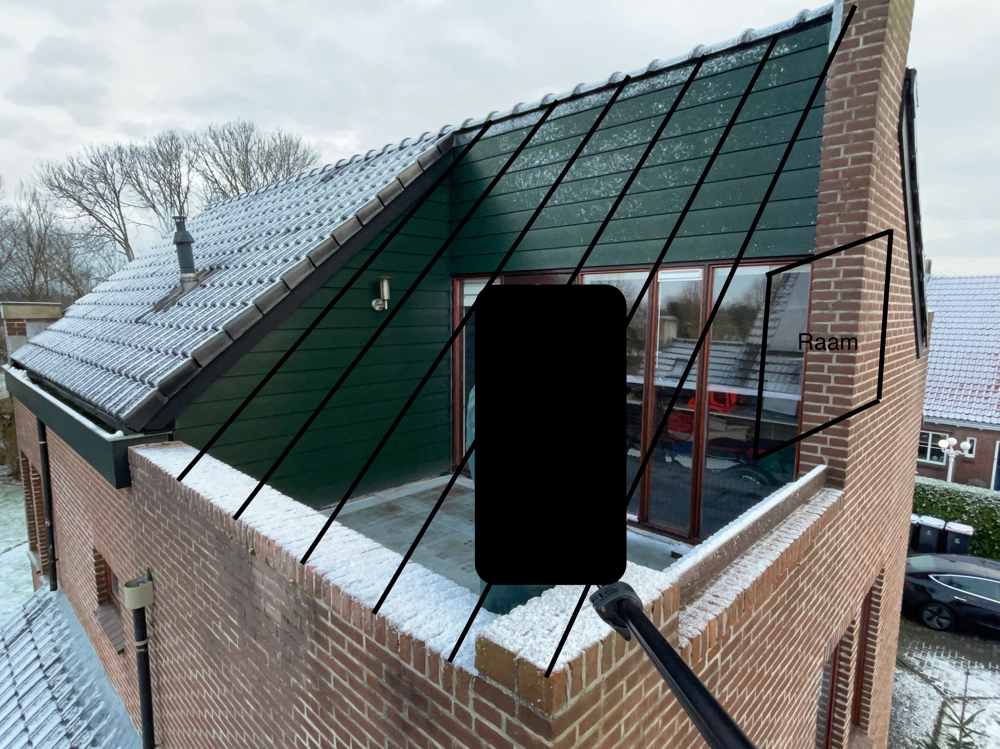

### General idea
There is a balcony on the third floor that I don't really need. Moreover, it causes leaks into the bedroom on the second floor during heavy rains. I want to reconstruct it by covering the balcony with a roof extended from the existing roof, efficiently making a new room on the third floor. 

### Current project status
To apply for a permit from the municipality, a civil engineering company is needed to create construction drawings.

### Answers to common questions:
* Area of the balcony is under 10m^2.
* The roof extension should use the same tiles as the existing roof, maintaining the same level and slope, with a seamless transition from the old to the new roof. If the exact tiles are unavailable, we should find the closest possible match.
* No walls, including facade walls and bearing walls, will be demolished.
* Biggest possible window should be installed, according to my estimations it's size can be 1600mm x 1200mm
* Area around the window should be covered with wood, matching existing wood color/pattern (green gorizontal planks).
* There are no strict deadlines yet, but time is valuable, as this project should be completed during the dry season.

### Visualisation
Current state:  

Desired state:  

Life picture:  

