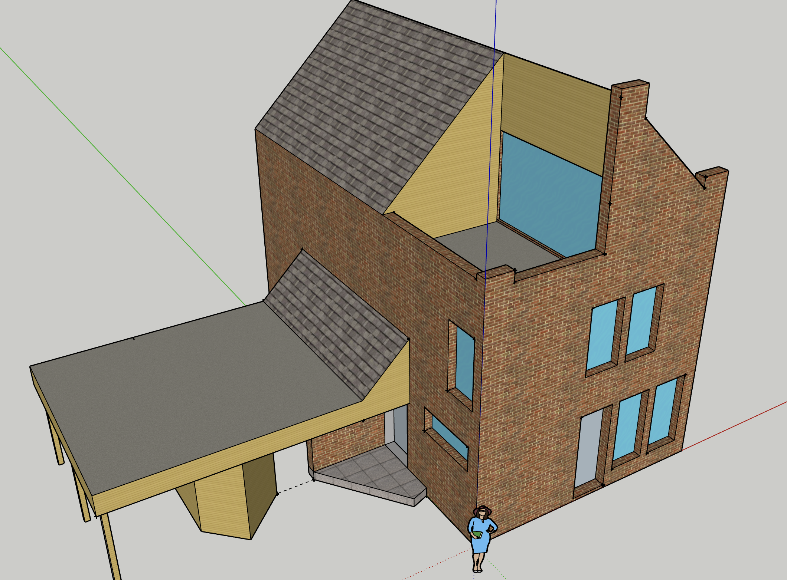
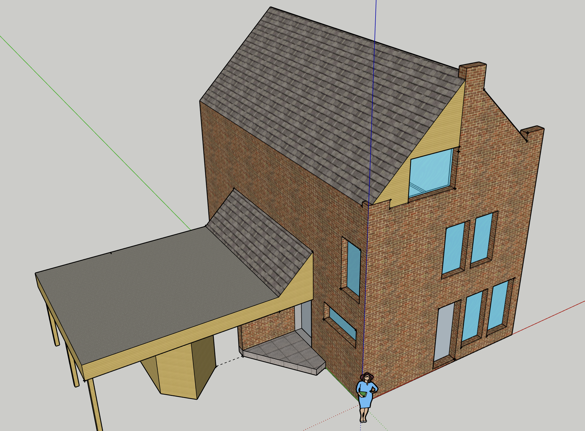

### General idea
There is a balcony on the third floor that I don't really need. Moreover, it causes leaks into the bedroom on the second floor during heavy rains. I want to reconstruct it by covering the balcony with a roof extended from the existing roof, efficiently making a new room on the third floor. 

### Visualisation
Current state:  

Desired state:  

